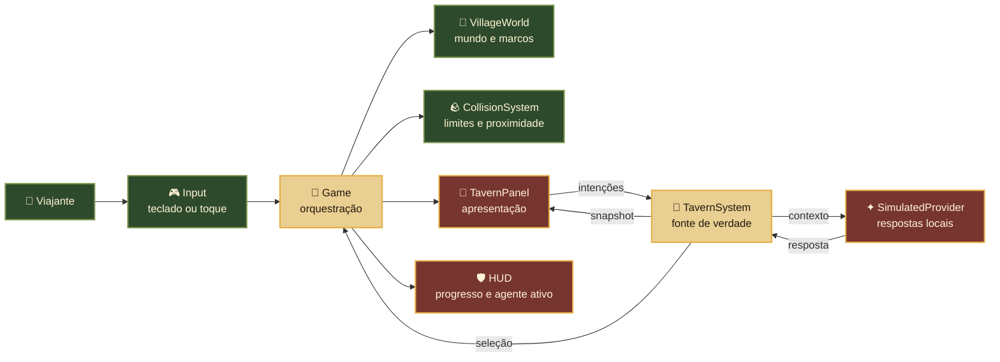

<div align="center">
  

  <h1>⚔️ Agentarium 🌿</h1>

  <p><strong>Uma vila medieval viva para criar, observar e aprender com agentes de inteligência artificial.</strong></p>
  <p>Projetos tornam-se expedições, tarefas viram missões e cada agente encontra seu lugar no reino.</p>

  <p>
    
    
    
    
  </p>
  <p>
    
    
    
  </p>

  <p>༺ 🌲 ✦ 🏰 ✦ 🌲 ༻</p>
</div>

> [!IMPORTANT]
> **Este projeto foi desenvolvido com assistência substancial de IA.** A visão,
> as escolhas de produto e a direção pertencem a Gustavo Martins; arquitetura,
> implementação, testes e documentação contaram principalmente com o
> **OpenAI Codex**, sempre sob supervisão humana.

## 🌄 O reino já pode ser explorado

<div align="center">
  
  <p><em>A praça central depois de descobrir os nove locais da vila.</em></p>
</div>

## 📜 Sobre o Agentarium

O Agentarium nasceu de uma pergunta: **e se sistemas de agentes deixassem de
parecer caixas-pretas e se transformassem em um mundo que podemos percorrer e
compreender?**

Nesta vila, cada construção representa uma responsabilidade real de um futuro
sistema de agentes. A Taverna reúne companheiros; a Guilda recebe projetos e
missões; a Ferraria executa tarefas; a Biblioteca preserva memória; e o Hospital
ajuda a investigar falhas.

O cenário não existe apenas para ser bonito. Ele é uma projeção visual para
responder perguntas importantes:

- quem está trabalhando e em qual missão;
- quais decisões e ferramentas foram usadas;
- onde aconteceu uma falha e como recuperá-la;
- quando uma ação exige aprovação humana;
- o que foi aprendido durante a jornada.

## ✨ O que já ganhou vida

| 🌲 Mundo | 🧭 Exploração | 🍺 Taverna | 🛡️ Engenharia |
| --- | --- | --- | --- |
| vila 3D em pixel/voxel art | movimento por teclado e toque | três agentes com papéis distintos | TypeScript em modo estrito |
| nove marcos e onze casas | câmera isométrica e corrida | fichas, especialidades e seleção | estado separado da apresentação |
| praça, fonte, jardins e estradas | proximidade e interação contextual | conversa determinística local | diagnósticos e hooks reproduzíveis |
| natureza, props e castelo distante | 36 colisores autorais | agente ativo permanece no HUD | testes funcionais e visuais |

### Pequenos encantamentos que fazem diferença

- 🔥 fogueiras, água, placas e ambiente possuem movimento procedural;
- 🎨 materiais e texturas são gerados localmente e compartilham a mesma paleta;
- 🎧 passos, descoberta, interface e vento usam WebAudio procedural;
- 📱 HUD, diálogos e controles respeitam telas pequenas e áreas seguras;
- ♿ teclado, toque, rótulos acessíveis e redução de movimento são considerados;
- 🌙 nenhum asset pago, telemetria ou serviço de nuvem é necessário para jogar.

## 🗺️ Atlas da vila

| Local | Papel no reino | Responsabilidade no produto | Estado |
| --- | --- | --- | --- |
| ⚔️ **Guilda** | salão das expedições | criar projetos e receber missões | planejado |
| 🍺 **Taverna** | encontro de companheiros | conhecer, conversar e selecionar agentes | **funcional** |
| 🔨 **Ferraria** | oficina dos executores | tarefas de código e uso de ferramentas | planejado |
| 📚 **Biblioteca** | arquivo dos sábios | memória, documentação e conceitos | planejado |
| ⛪ **Igreja** | espaço de contemplação | revisão de decisões e histórico | planejado |
| 🔮 **Torre do Mago** | laboratório arcano | modelos, prompts e experimentos | planejado |
| 🧺 **Mercado** | feira de artefatos | integrações e ferramentas futuras | planejado |
| 🏥 **Hospital** | casa de recuperação | erros, diagnóstico e retomadas | planejado |
| 🏡 **Sua Casa** | refúgio do viajante | configurações, progresso e diário | planejado |

## 🍻 Taverna do Grifo Dourado

<div align="center">
  
  <p><em>O primeiro edifício realmente funcional do Agentarium.</em></p>
</div>

| Companheiro | Classe | Ofício | Especialidades |
| --- | --- | --- | --- |
| ✦ **Aldren** | Corvo Oráculo | Estrategista | planejamento, pesquisa e prompts |
| ⚒ **Brunna** | Texugo Ferreiro | Executor | código, testes e ferramentas |
| ✥ **Selene** | Coruja Clériga | Revisora | revisão, memória e segurança |

As conversas atuais são **simulações locais e determinísticas**. Elas permitem
validar produto, estado e experiência sem chave, custo ou dependência de rede.
O contrato `AgentConversationProvider` foi criado para que um provedor real possa
ser conectado futuramente sem reescrever a Taverna.

## 🪄 Como a magia circula



O domínio não conhece HTML, Three.js ou serviços de IA. A interface apenas
renderiza snapshots e envia intenções. O `Game` conecta essas partes sem criar
uma segunda fonte de verdade.

## 🧰 Grimório técnico

| Camada | Tecnologia ou responsabilidade |
| --- | --- |
| linguagem | TypeScript 6 em modo estrito |
| mundo 3D | Three.js 0.184 |
| desenvolvimento e build | Vite 8.2 |
| interface | HTML semântico e CSS responsivo |
| render | pixel pass adaptativo, tone mapping, sombras e névoa |
| domínio | tipos imutáveis, estado observável e providers substituíveis |
| áudio | WebAudio procedural e local |
| qualidade | Playwright, PNGJS, diagnósticos e regressão visual |

### Estrutura do reino

```text
src/
├── assets/       materiais, texturas e fábricas procedurais
├── core/         loop, renderer e entrada do jogador
├── domain/       contratos e perfis dos agentes
├── entities/     personagem e movimento
├── game/         orquestração da experiência
├── systems/      HUD, câmera, colisão, áudio e Taverna
└── world/        mapa, marcos, interações e diagnóstico

tests/            jornadas reais e baselines visuais
docs/             contratos de design e relatórios de evidência
```

## 🚪 Entrando na vila

### Pré-requisitos

- Node.js `20.19+` ou `22.12+`;
- npm;
- navegador moderno com WebGL.

### Jornada local

```bash
git clone https://github.com/gustavomartins-dev/agentarium.git
cd agentarium
git switch local
npm install
npm run dev
```

Abra `http://127.0.0.1:5173` ou a porta indicada pelo Vite.

### Controles

| Ação | Teclado | Celular |
| --- | --- | --- |
| caminhar | `WASD` ou setas | joystick virtual |
| correr | `Shift` ou `Espaço` | — |
| interagir | `E` ou `Enter` | botão **Interagir** |
| fechar painel | `Esc` ou botão `×` | botão `×` |

## 🧪 Provas antes das lendas

```bash
npm run build
npm test
npm run verify:visual
npm run inspect:canvas -- --state tavern-open
```

Último checkpoint completo registrado:

- ✅ 13 testes aprovados e 1 tour mobile compartilhado ignorado intencionalmente;
- ✅ 6 baselines de regressão visual em desktop e mobile;
- ✅ nove entradas alcançáveis e 36 proxies de colisão auditados;
- ✅ Taverna dentro do orçamento: 155 draw calls no desktop e 146 no mobile;
- ✅ zero erros de console ou página nas inspeções finais;
- ✅ zero vulnerabilidades conhecidas na auditoria npm daquele checkpoint.

## 🌉 Caminho entre os reinos

```text
local  ──►  hml  ──►  main
forja       prova      versão estável
```

- `local`: desenvolvimento cotidiano;
- `hml`: homologação e playtests;
- `main`: versão estável apresentada no GitHub.

Mudanças devem subir de reino somente depois de build, testes e inspeção
proporcionais ao risco.

## 🧭 Próximas expedições

- [ ] transformar a Guilda em criação de projeto e missão simulada;
- [ ] levar tarefas de código e execução para a Ferraria;
- [ ] registrar memória e conceitos aprendidos na Biblioteca;
- [ ] representar planejamento, execução, revisão, erro e aprovação no mundo;
- [ ] persistir projetos e histórico localmente;
- [ ] adicionar progressão ligada a boas práticas e aprendizado real;
- [ ] conectar uma primeira IA opcional, limitada e protegida por backend;
- [ ] permitir ferramentas somente com escopo, isolamento e aprovação humana.

## 🕯️ Sem encantamento falso

O Agentarium ainda é uma **alpha jogável e local-first**:

- a Taverna conversa por regras determinísticas, não por um modelo de IA real;
- os agentes ainda não executam código, arquivos ou ferramentas;
- não existem conta, backend, banco, nuvem ou sincronização;
- seleção e conversa duram apenas durante a sessão atual;
- personagens e sigilos são provisórios;
- os outros oito edifícios apresentam sua função, mas ainda não a executam.

Esses limites são intencionais. Primeiro provamos a experiência e os contratos;
depois adicionamos poder com segurança e evidência.

## 🛡️ Regras do laboratório

- o projeto é pessoal e não possui relação com sistemas ou dados profissionais;
- ferramentas gratuitas, abertas e locais têm prioridade;
- nenhuma API paga, telemetria ou coleta oculta sem aprovação explícita;
- chaves nunca entram no frontend, Git, logs ou documentação;
- código gerado por agentes não será executado sem isolamento e confirmação;
- commits, pushes e mudanças de escopo precisam de autorização do proprietário.

## 📚 Crônicas e mapas

- [Contrato da primeira fatia jogável](./docs/primeira-fatia-jogavel.md)
- [Relatório de evidências da vila](./docs/relatorio-primeira-fatia.md)
- [Contrato funcional da Taverna](./docs/fatia-taverna.md)
- [Relatório de evidências da Taverna](./docs/relatorio-taverna.md)

As decisões completas de produto e aprendizado também são mantidas no Obsidian
pessoal do projeto.

## 🤖 Transparência sobre IA

O Agentarium não tenta esconder como foi construído. O OpenAI Codex participou
de forma substancial da arquitetura, código, arte procedural, interface, testes,
otimização e documentação. A direção, os objetivos, as aprovações e o julgamento
final permanecem humanos.

O próprio projeto existe para aprender a usar essa colaboração com honestidade:
entender o código, registrar decisões, medir resultados e nunca confundir uma
simulação bonita com autonomia real.

## 🌿 Código aberto

O código original do Agentarium está disponível sob a [licença MIT](./LICENSE).
Dependências mantêm suas próprias licenças. Ideias, issues e pull requests são
bem-vindos enquanto respeitarem a proposta local-first, segura e educacional.

<div align="center">
  <p>༺ 🌲 ✦ 🏰 ✦ 🌲 ༻</p>
  <strong>Que cada missão deixe o reino mais sábio.</strong>
  <br />
  <sub>construído com código, curiosidade e um pouco de magia procedural</sub>
</div>
