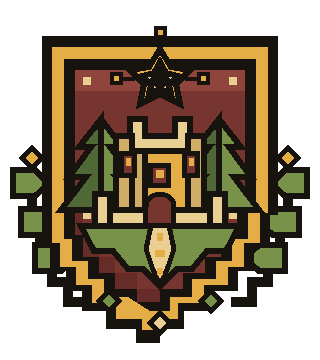
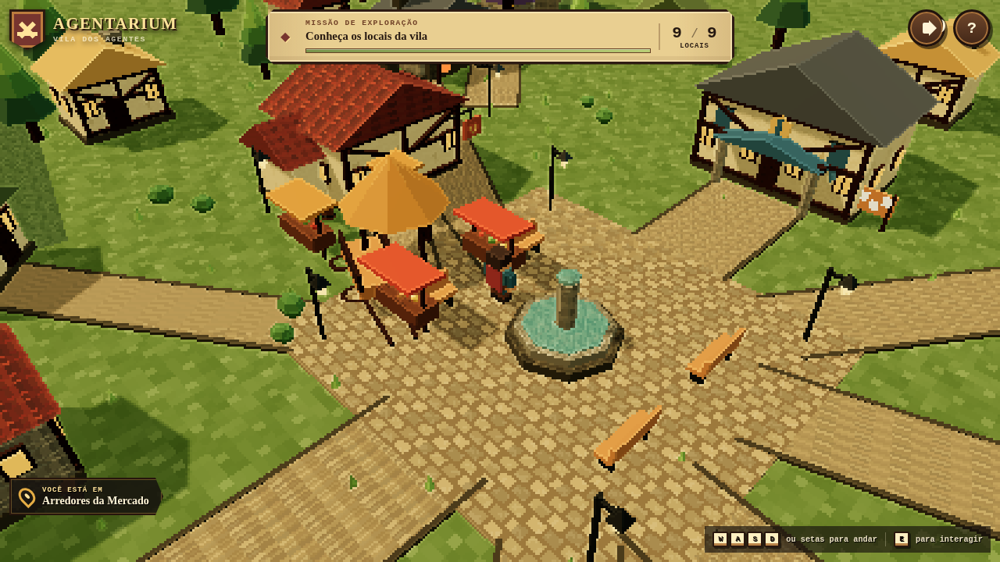
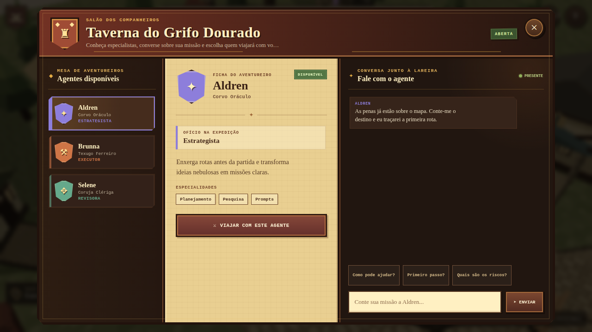
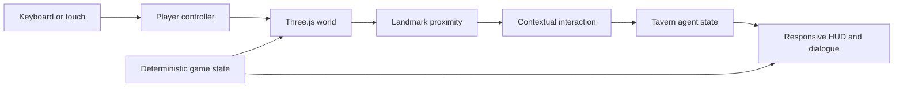

<div align="center">
  
  <h1>⚔️ Agentarium 🌿</h1>
  <p><strong>A living medieval village where you can create, observe, and learn from AI agents.</strong></p>
  <p>Projects become expeditions, tasks become quests, and every agent finds a place in the realm.</p>
  <p>
    
    
    
    
  </p>
  <p>
    
    
    
  </p>
  <p>༺ 🌲 ✦ 🏰 ✦ 🌲 ༻</p>
</div>

## 🌄 The realm is already explorable

<div align="center">
  
  <p><em>The central square after discovering all nine village landmarks.</em></p>
</div>

## 📜 Why Agentarium exists

Agentarium started with one question: **what if agent systems stopped looking
like black boxes and became a world we could walk through and understand?**

Every building represents a real responsibility in a future agent platform.
The Tavern gathers companions, the Guild receives projects and quests, the
Forge executes tasks, the Library preserves memory, and the Hospital helps
investigate failures.

The world is designed to answer practical questions visually: who is working,
which tools and decisions were used, where a failure happened, when human
approval is required, and what the system learned.

## ✨ What is alive today

| World | Exploration | Golden Griffin Tavern | Engineering |
| --- | --- | --- | --- |
| 3D pixel/voxel village | Keyboard and touch movement | Three distinct agents | Strict TypeScript |
| Nine landmarks, eleven houses | Isometric camera and sprinting | Profiles and specialties | State separated from rendering |
| Square, fountain, gardens, roads | 36 authored colliders | Deterministic local dialogue | Reproducible diagnostic hooks |
| Animated environment | Contextual interactions | Active agent stays in the HUD | Functional and visual tests |

- procedural fire, water, signs, and ambient movement;
- locally generated materials sharing one art direction;
- procedural WebAudio footsteps, discoveries, UI, and wind;
- responsive HUD, dialogue, and touch controls with safe-area support;
- keyboard navigation, accessible labels, and reduced-motion support;
- no paid assets, telemetry, or cloud service required.

## 🗺️ Atlas of the village

| Place | Role in the realm | Product responsibility | Status |
| --- | --- | --- | --- |
| ⚔️ Guild | Expedition hall | Projects and quests | Planned |
| 🍺 Tavern | Companion meeting place | Discover, talk to, and select agents | **Working** |
| 🔨 Forge | Executors' workshop | Code tasks and tool use | Planned |
| 📚 Library | Scholars' archive | Memory, documentation, concepts | Planned |
| ⛪ Church | Reflection chamber | Decision review and history | Planned |
| 🔮 Wizard Tower | Arcane laboratory | Models, prompts, experiments | Planned |
| 🧺 Market | Artifact fair | Integrations and future tools | Planned |
| 🏥 Hospital | Recovery house | Errors, diagnosis, recovery | Planned |
| 🏡 Your House | Player refuge | Settings, progress, journal | Planned |

## 🍻 The Golden Griffin Tavern

<div align="center">
  
</div>

The Tavern is the first working vertical slice of the future agent system. Walk
up to a companion, open the dialogue, inspect their role, and make them the
active agent. The current conversation is deterministic and local, making the
experience honest and reproducible while real orchestration is still being
built.

## 🪄 How the magic flows



## 🧰 Technical grimoire

```text
src/
├── core/       loop, state, input, and application boundaries
├── game/       player, collision, landmarks, and interactions
├── scene/      village, environment, materials, and camera
├── ui/         HUD, dialogue, touch controls, and overlays
└── audio/      procedural WebAudio feedback
```

## 🚪 Enter the village

Requirements: Node.js 20+ and npm.

```bash
npm install
npm run dev
```

Controls:

- `WASD` or arrow keys to move;
- `Shift` to run;
- `E` or the contextual button to interact;
- touch joystick and action button on mobile.

## 🧪 Evidence before legends

```bash
npm test
npm run verify:visual
npm run build
```

Playwright snapshots cover desktop and mobile exploration states. These images
are both documentation and regression evidence: visual changes must be
intentional.

## 🧭 Next expeditions

The current alpha proves the world, exploration, and Tavern interaction. The
next major step is connecting village roles to real agent orchestration with
observable tool calls, approval gates, memory, and recovery.

## 🕯️ No false magic

Current agents do not call external models or execute real tasks. Dialogue and
state transitions are local simulations. The README names planned features as
planned so the world never claims capabilities it cannot demonstrate.

## 🤖 AI transparency

Vision and product direction belong to Gustavo Martins. Architecture,
implementation, tests, art systems, and documentation were created with
substantial OpenAI Codex assistance under human supervision.

## 🌿 Open source

Released under the [MIT License](LICENSE).
